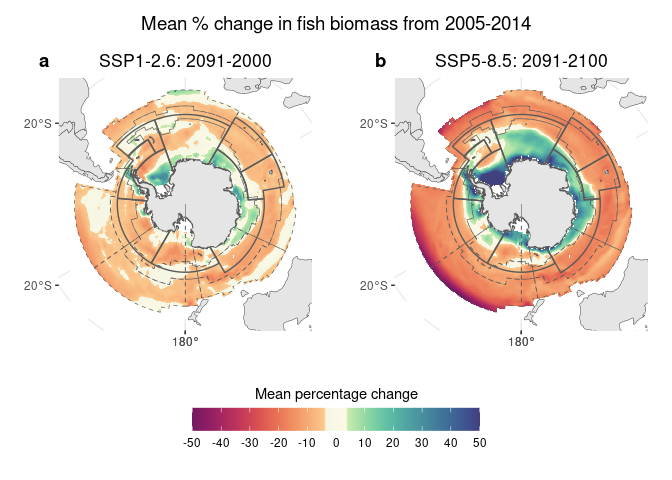
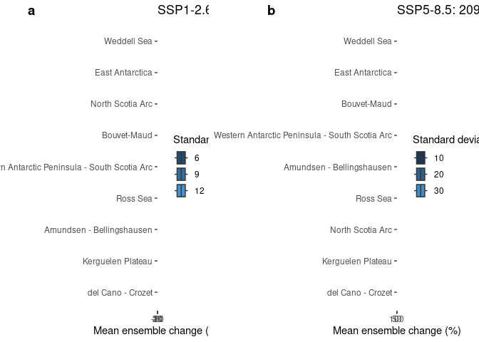

Mapping changes to exploitable fish biomass in the Southern Ocean
================
Denisse Fierro Arcos
2/19/24

- <a href="#changes-in-total-consumer-biomass-in-the-southern-ocean"
  id="toc-changes-in-total-consumer-biomass-in-the-southern-ocean">Changes
  in total consumer biomass in the Southern Ocean</a>
  - <a href="#loading-libraries" id="toc-loading-libraries">Loading
    libraries</a>
  - <a href="#setting-up-notebook" id="toc-setting-up-notebook">Setting up
    notebook</a>
  - <a href="#loading-data" id="toc-loading-data">Loading data</a>
  - <a
    href="#calculating-percentage-change-in-fish-biomass-estimates-from-global-fishmip-models"
    id="toc-calculating-percentage-change-in-fish-biomass-estimates-from-global-fishmip-models">Calculating
    percentage change in fish biomass estimates from global FishMIP
    models</a>
    - <a href="#calculating-ensemble-mean-and-standard-deviation"
      id="toc-calculating-ensemble-mean-and-standard-deviation">Calculating
      ensemble mean and standard deviation</a>
  - <a href="#world-base-map" id="toc-world-base-map">World base map</a>
  - <a href="#plotting-exploitable-fish-biomass"
    id="toc-plotting-exploitable-fish-biomass">Plotting exploitable fish
    biomass</a>
    - <a href="#ccamlr-plots" id="toc-ccamlr-plots">CCAMLR plots</a>

# Changes in total consumer biomass in the Southern Ocean

In this notebook, we will use all FishMIP global models to calculate the
mean ensemble percentage change in total consumer biomass in the
Southern Ocean for the decade ending in 2100. The reference period for
this calculation is 2005-2014. Total consumer biomass includes all
consumers (vertebrates and invertebrates) with trophic level above 1.

## Loading libraries

``` r
#Data wrangling
library(tidyverse)
library(data.table)
#Dealing with raster data
library(terra)
library(tidyterra)
#Dealing with vector data
library(sf)
#Base maps
library(rnaturalearth)
library(measoshapes)
#Color palettes
library(cmocean)
#Combining plots
library(cowplot)
```

## Setting up notebook

We will define the folders where inputs are kept, and where outputs
should be saved.

``` r
#Base folder for project
base_folder <- "/rd/gem/public/fishmip/SOMEME/"

#Defining location of notebook outputs
out_folder <- "../outputs"
if(!dir.exists(out_folder)){
  dir.create(out_folder)
}
```

## Loading data

We will load the total consumer biomass data to calculate percentage
change, and masks to extract data for the MEASO and CCAMLR regions only.

``` r
#MEASO
measo_mask <- read_csv("../outputs/measo_regions_1deg.csv")
```

    Rows: 15679 Columns: 4
    ── Column specification ────────────────────────────────────────────────────────
    Delimiter: ","
    dbl (4): x, y, id, area_m

    ℹ Use `spec()` to retrieve the full column specification for this data.
    ℹ Specify the column types or set `show_col_types = FALSE` to quiet this message.

``` r
measo_keys <- read_csv("../outputs/measo_regions_keys.csv")
```

    Rows: 18 Columns: 2
    ── Column specification ────────────────────────────────────────────────────────
    Delimiter: ","
    chr (1): name
    dbl (1): id

    ℹ Use `spec()` to retrieve the full column specification for this data.
    ℹ Specify the column types or set `show_col_types = FALSE` to quiet this message.

``` r
#CCAMLR
ccamlr_mask <- read_csv("../outputs/ccamlr_mpa_planning_1deg.csv")
```

    Rows: 7443 Columns: 4
    ── Column specification ────────────────────────────────────────────────────────
    Delimiter: ","
    dbl (4): x, y, Name, area_m

    ℹ Use `spec()` to retrieve the full column specification for this data.
    ℹ Specify the column types or set `show_col_types = FALSE` to quiet this message.

``` r
ccamlr_keys <- read_csv("../outputs/ccamlr_mpa_planning_keys.csv")
```

    Rows: 10 Columns: 2
    ── Column specification ────────────────────────────────────────────────────────
    Delimiter: ","
    chr (1): Location
    dbl (1): Name

    ℹ Use `spec()` to retrieve the full column specification for this data.
    ℹ Specify the column types or set `show_col_types = FALSE` to quiet this message.

``` r
#Joining MEASO and CCAMLR masks into a single data frame
measo_ccamlr <- full_join(measo_mask, ccamlr_mask, 
                          by = join_by(x, y, area_m)) |> 
  #Rename ID columns
  rename("measo"="id", "ccamlr"="Name", "lon"="x", "lat"="y")

#Getting a list of files containing total consumer biomass data
global_files <- list.files(base_folder, full.names = T, recursive = T) |> 
  #Keeping only experiments of interest (matching models for FAO report)
  str_subset("apecosm_ipsl|boats|dbpm_ipsl|ecotroph|macroecological|zoomss") |> 
  str_subset("nat_default") |> 
  #Removing "picontrol" experiment
  str_subset("picontrol", negate = T)
```

## Calculating percentage change in fish biomass estimates from global FishMIP models

We will go through each FishMIP model and calculate the mean fish
biomass for the decade between 2005 and 2014 (last decade of
`historical` period), and for the period between 2091 and 2100 (for the
two emission scenarios). Finally, we will calculate the percentage
change between these two decades.

``` r
#Looping through each file
for(f in global_files){
  #Getting name of model and scenario
  mem <- str_extract(basename(f), "^(.*)-(c|e)", group = 1)
  scenario <- str_extract(f, "nobasd_(.*)_nat", group = 1)
  #Loading file
  df <- read_csv(f, col_select = time:tcb) |> 
    mutate(year = year(time)) |> 
    #Extract data only for years to be used in maps
    filter(year >= 2005 & year <= 2014 | year >= 2091 & year <= 2100) |> 
    #Create new group column to calculate means
    mutate(group = case_when(year <= 2014 ~ "reference",
                             year >= 2091 & year <= 2100 ~ "mean00"),
           scenario = scenario,
           #The new group column also need to have the scenario as part of the label
           group = case_when(group != "reference" ~ 
                               str_c(group, scenario, sep = "_"),
                             T ~ group),
           mem = mem) |> 
    separate_wider_delim(mem, delim = "_", names = c("mem", "esm")) |> 
    group_by(lat, lon, mem, esm, group) |> 
    summarise(mean_bio = mean(tcb, na.rm = T)) |> 
    ungroup()
  
  #Path to save file
  f_out <- file.path(out_folder,
                     paste0(mem, "_gridded_mean_", scenario, ".csv"))
  
  #Saving results for each model
  df |> 
    fwrite(f_out)
}
```

``` r
#Getting a list of files containing total consumer biomass data
global_files <- list.files(out_folder, "gridded_mean",
                           full.names = T, recursive = T)

#Getting a list of models
members <- basename(global_files) |> 
  str_extract("^(.*)_gridded", group = 1) |> 
  #Excluding DBPM and ZOOMS IPSL because of different grid
  str_subset("dbpm|zoomss_ipsl", negate = T) |> 
  unique()

#Loading data for each model
for(m in members){
  #Load all data available for a single FishMIP model
  df_model <- str_subset(global_files, m) |> 
    map(~read_csv(.)) |> 
    map_df(~bind_rows(.)) |> 
    #Reorganise table to facilitate calculations
    pivot_wider(names_from = group, values_from = mean_bio) |> 
    #Calculate % change in fish biomass for the two emissions scenarios
    mutate(rel_change_mean00_ssp126 = ((mean00_ssp126-reference)/reference)*100,
           rel_change_mean00_ssp585 = ((mean00_ssp585-reference)/reference)*100)
   
  #Create name to save file  
  f_out <- file.path(out_folder, str_c(m, "_perc_bio_change_data_map.csv"))
  
  #Saving results for each model
  df_model |> 
    fwrite(f_out)
}
```

    Rows: 21600 Columns: 6
    ── Column specification ────────────────────────────────────────────────────────
    Delimiter: ","
    chr (3): mem, esm, group
    dbl (3): lat, lon, mean_bio

    ℹ Use `spec()` to retrieve the full column specification for this data.
    ℹ Specify the column types or set `show_col_types = FALSE` to quiet this message.
    Rows: 21600 Columns: 6
    ── Column specification ────────────────────────────────────────────────────────
    Delimiter: ","
    chr (3): mem, esm, group
    dbl (3): lat, lon, mean_bio

    ℹ Use `spec()` to retrieve the full column specification for this data.
    ℹ Specify the column types or set `show_col_types = FALSE` to quiet this message.
    Rows: 21600 Columns: 6
    ── Column specification ────────────────────────────────────────────────────────
    Delimiter: ","
    chr (3): mem, esm, group
    dbl (3): lat, lon, mean_bio

    ℹ Use `spec()` to retrieve the full column specification for this data.
    ℹ Specify the column types or set `show_col_types = FALSE` to quiet this message.
    Rows: 21600 Columns: 6
    ── Column specification ────────────────────────────────────────────────────────
    Delimiter: ","
    chr (3): mem, esm, group
    dbl (3): lat, lon, mean_bio

    ℹ Use `spec()` to retrieve the full column specification for this data.
    ℹ Specify the column types or set `show_col_types = FALSE` to quiet this message.
    Rows: 21600 Columns: 6
    ── Column specification ────────────────────────────────────────────────────────
    Delimiter: ","
    chr (3): mem, esm, group
    dbl (3): lat, lon, mean_bio

    ℹ Use `spec()` to retrieve the full column specification for this data.
    ℹ Specify the column types or set `show_col_types = FALSE` to quiet this message.
    Rows: 21600 Columns: 6
    ── Column specification ────────────────────────────────────────────────────────
    Delimiter: ","
    chr (3): mem, esm, group
    dbl (3): lat, lon, mean_bio

    ℹ Use `spec()` to retrieve the full column specification for this data.
    ℹ Specify the column types or set `show_col_types = FALSE` to quiet this message.
    Rows: 21600 Columns: 6
    ── Column specification ────────────────────────────────────────────────────────
    Delimiter: ","
    chr (3): mem, esm, group
    dbl (3): lat, lon, mean_bio

    ℹ Use `spec()` to retrieve the full column specification for this data.
    ℹ Specify the column types or set `show_col_types = FALSE` to quiet this message.
    Rows: 21600 Columns: 6
    ── Column specification ────────────────────────────────────────────────────────
    Delimiter: ","
    chr (3): mem, esm, group
    dbl (3): lat, lon, mean_bio

    ℹ Use `spec()` to retrieve the full column specification for this data.
    ℹ Specify the column types or set `show_col_types = FALSE` to quiet this message.
    Rows: 21600 Columns: 6
    ── Column specification ────────────────────────────────────────────────────────
    Delimiter: ","
    chr (3): mem, esm, group
    dbl (3): lat, lon, mean_bio

    ℹ Use `spec()` to retrieve the full column specification for this data.
    ℹ Specify the column types or set `show_col_types = FALSE` to quiet this message.
    Rows: 21600 Columns: 6
    ── Column specification ────────────────────────────────────────────────────────
    Delimiter: ","
    chr (3): mem, esm, group
    dbl (3): lat, lon, mean_bio

    ℹ Use `spec()` to retrieve the full column specification for this data.
    ℹ Specify the column types or set `show_col_types = FALSE` to quiet this message.
    Rows: 21600 Columns: 6
    ── Column specification ────────────────────────────────────────────────────────
    Delimiter: ","
    chr (3): mem, esm, group
    dbl (3): lat, lon, mean_bio

    ℹ Use `spec()` to retrieve the full column specification for this data.
    ℹ Specify the column types or set `show_col_types = FALSE` to quiet this message.
    Rows: 21600 Columns: 6
    ── Column specification ────────────────────────────────────────────────────────
    Delimiter: ","
    chr (3): mem, esm, group
    dbl (3): lat, lon, mean_bio

    ℹ Use `spec()` to retrieve the full column specification for this data.
    ℹ Specify the column types or set `show_col_types = FALSE` to quiet this message.
    Rows: 21600 Columns: 6
    ── Column specification ────────────────────────────────────────────────────────
    Delimiter: ","
    chr (3): mem, esm, group
    dbl (3): lat, lon, mean_bio

    ℹ Use `spec()` to retrieve the full column specification for this data.
    ℹ Specify the column types or set `show_col_types = FALSE` to quiet this message.
    Rows: 21600 Columns: 6
    ── Column specification ────────────────────────────────────────────────────────
    Delimiter: ","
    chr (3): mem, esm, group
    dbl (3): lat, lon, mean_bio

    ℹ Use `spec()` to retrieve the full column specification for this data.
    ℹ Specify the column types or set `show_col_types = FALSE` to quiet this message.
    Rows: 21600 Columns: 6
    ── Column specification ────────────────────────────────────────────────────────
    Delimiter: ","
    chr (3): mem, esm, group
    dbl (3): lat, lon, mean_bio

    ℹ Use `spec()` to retrieve the full column specification for this data.
    ℹ Specify the column types or set `show_col_types = FALSE` to quiet this message.
    Rows: 21600 Columns: 6
    ── Column specification ────────────────────────────────────────────────────────
    Delimiter: ","
    chr (3): mem, esm, group
    dbl (3): lat, lon, mean_bio

    ℹ Use `spec()` to retrieve the full column specification for this data.
    ℹ Specify the column types or set `show_col_types = FALSE` to quiet this message.
    Rows: 21600 Columns: 6
    ── Column specification ────────────────────────────────────────────────────────
    Delimiter: ","
    chr (3): mem, esm, group
    dbl (3): lat, lon, mean_bio

    ℹ Use `spec()` to retrieve the full column specification for this data.
    ℹ Specify the column types or set `show_col_types = FALSE` to quiet this message.
    Rows: 21600 Columns: 6
    ── Column specification ────────────────────────────────────────────────────────
    Delimiter: ","
    chr (3): mem, esm, group
    dbl (3): lat, lon, mean_bio

    ℹ Use `spec()` to retrieve the full column specification for this data.
    ℹ Specify the column types or set `show_col_types = FALSE` to quiet this message.
    Rows: 21600 Columns: 6
    ── Column specification ────────────────────────────────────────────────────────
    Delimiter: ","
    chr (3): mem, esm, group
    dbl (3): lat, lon, mean_bio

    ℹ Use `spec()` to retrieve the full column specification for this data.
    ℹ Specify the column types or set `show_col_types = FALSE` to quiet this message.
    Rows: 21600 Columns: 6
    ── Column specification ────────────────────────────────────────────────────────
    Delimiter: ","
    chr (3): mem, esm, group
    dbl (3): lat, lon, mean_bio

    ℹ Use `spec()` to retrieve the full column specification for this data.
    ℹ Specify the column types or set `show_col_types = FALSE` to quiet this message.
    Rows: 21600 Columns: 6
    ── Column specification ────────────────────────────────────────────────────────
    Delimiter: ","
    chr (3): mem, esm, group
    dbl (3): lat, lon, mean_bio

    ℹ Use `spec()` to retrieve the full column specification for this data.
    ℹ Specify the column types or set `show_col_types = FALSE` to quiet this message.
    Rows: 21600 Columns: 6
    ── Column specification ────────────────────────────────────────────────────────
    Delimiter: ","
    chr (3): mem, esm, group
    dbl (3): lat, lon, mean_bio

    ℹ Use `spec()` to retrieve the full column specification for this data.
    ℹ Specify the column types or set `show_col_types = FALSE` to quiet this message.
    Rows: 21600 Columns: 6
    ── Column specification ────────────────────────────────────────────────────────
    Delimiter: ","
    chr (3): mem, esm, group
    dbl (3): lat, lon, mean_bio

    ℹ Use `spec()` to retrieve the full column specification for this data.
    ℹ Specify the column types or set `show_col_types = FALSE` to quiet this message.
    Rows: 21600 Columns: 6
    ── Column specification ────────────────────────────────────────────────────────
    Delimiter: ","
    chr (3): mem, esm, group
    dbl (3): lat, lon, mean_bio

    ℹ Use `spec()` to retrieve the full column specification for this data.
    ℹ Specify the column types or set `show_col_types = FALSE` to quiet this message.

### Calculating ensemble mean and standard deviation

We will now load the percentage change in biomass for all global models
and calculate an ensemble mean and standard deviation.

``` r
#Listing all relevant files to calculate biomass projections
maps_data <- list.files(out_folder, pattern = "_perc_bio_change_data_map.csv", 
                        full.names = T) |> 
  map_df(~fread(.)) |> 
  #Calculations performed by year and EEZ
  group_by(lat, lon) |> 
  #Apply calculations to biases only
  summarise(across(rel_change_mean00_ssp126:rel_change_mean00_ssp585, 
                   #Listing statistics to be calculated
                   list(mean = mean), 
                   #Setting column names
                   .names = "{.col}_{.fn}")) |> 
  #Apply mask
  left_join(measo_ccamlr, by = join_by(lon, lat)) |>
  group_by(ccamlr) |> 
  mutate(ssp126_sd = sd(rel_change_mean00_ssp126_mean, na.rm = T),
         ssp585_sd = sd(rel_change_mean00_ssp585_mean, na.rm = T))|> 
  ungroup()
```

    `summarise()` has grouped output by 'lat'. You can override using the `.groups`
    argument.

## World base map

``` r
#South Polar Stereographic projection
sp_proj <- "+proj=laea +lat_0=-90 +lon_0=0 +x_0=0 +y_0=0 +datum=WGS84 +units=m +no_defs +type=crs"

#Base map of the world
world_proj <- ne_countries(returnclass = "sf") |> 
  st_transform(sp_proj)
```

## Plotting exploitable fish biomass

We will use the masks to create plots using the MEASO and CCAMLR
boundaries, but first we will define a colourmap to be used in all maps,
and the basic plotting instructions.

``` r
#Create custom-made color palette
scale_fill_custom <- function(..., alpha = 1, begin = 0, end = 1, direction = 1, 
  option = "D", values = NULL, space = "Lab", na.value = "white", 
  guide = "colourbar", aesthetics = "fill") {
  continuous_scale(aesthetics, scale_name = "custom", 
    palette = scales:::gradient_n_pal(c(cmocean("matter", start = 0.1, 
                                                end = 0.8, direction = -1)(123),
                                        cmocean("delta", start = 0.49, 
                                                end = 0.5)(20),
                                        cmocean("deep", start = 0.1, 
                                                end = 0.8)(123)), values, space), 
    na.value = na.value, guide = guide, ...)
}
```

### CCAMLR plots

``` r
#Loading CCAMLR boundaries
ccamlr <- read_sf("../../SO_shapefiles/CCAMLR_MPA_Planning_Domains/CCAMLR_MPA_Planning_Domains.shp") |> 
  st_set_crs(6932)

#Loading CCAMLR boundaries
measo <- measo_regions05_coastline |> 
  filter(str_detect(name, "T$", negate = T)) |> 
  st_transform(6932)
```

    old-style crs object detected; please recreate object with a recent sf::st_crs()

``` r
#Apply projection to 
maps_data_proj <- maps_data |> 
  #Selecting areas within CCAMLR boundaries
  drop_na(measo) |> 
  #Selecting coordinate columns and percentage change columns
  select(lon, lat, starts_with("rel_change")) |> 
  #Transform to multi-layer raster
  rast(type = "xyz", crs = "epsg:4326") |> 
  #Reproject to Robinson
  project(y = sp_proj) 

#Define base steps for maps
base_gg_perc <- list(scale_fill_binned(limits = c(-50, 50), n.breaks = 8,
                                  type = scale_fill_custom,
                                  oob = scales::oob_squish),
                     geom_sf(inherit.aes = F, data = measo, fill = NA, 
                             colour = "#5b5b5b", show.legend = F, 
                             linewidth = 0.25, linetype = "dashed"),
                     geom_sf(inherit.aes = F, data = ccamlr, fill = NA, 
                             colour = "#5b5b5b", show.legend = F, 
                             linewidth = 0.5),
                     geom_sf(inherit.aes = F, data = world_proj, 
                             show.legend = F),
                     lims(y = c(-5593136, 5593136), x = c(-5598164, 5598164)),
                     theme_bw(),
                     theme(axis.title = element_blank(), 
                           panel.border = element_rect(colour = NA),
                           plot.title = element_text(hjust = 0.5),
                           legend.position = "none"))
```

We can now plot mean percentage change in fish biomass for the FishMIP
ensemble within the CCAMLR boundaries.

``` r
#Mean percentage change
#SSP1-2.6 2041-2050
p00_126 <- ggplot()+
  geom_spatraster(data = maps_data_proj$rel_change_mean00_ssp126_mean)+
  labs(title = "SSP1-2.6: 2091-2000")+
  base_gg_perc
```

    SpatRaster resampled to ncells = 501264

``` r
#SSP5-8.5 2041-2050
p00_585 <- ggplot()+
  geom_spatraster(data = maps_data_proj$rel_change_mean00_ssp585_mean)+
  labs(title = "SSP5-8.5: 2091-2100")+
  base_gg_perc+
  guides(fill = guide_colorbar(title = "Mean percentage change",
                               title.position = "top", title.hjust = 0.5, 
                               barwidth = 15))+
  theme(legend.position = "bottom")
```

    SpatRaster resampled to ncells = 501264

``` r
#Get legend
leg <- get_legend(p00_585)

#Remove legend
p00_585 <- p00_585+
  theme(legend.position = "none")

#Create title for plot
title <- ggdraw()+
  draw_label("Mean % change in fish biomass from 2005-2014")+
  theme(plot.margin = margin(0, 0, 0, 0, unit = "cm"))

#Plotting everything together
all_plots <- plot_grid(title, plot_grid(p00_126, p00_585, ncol = 2, nrow = 1,
                                        labels = c("a", "b"), label_x = 0.1),
                       leg, ncol = 1, nrow = 3, 
                       rel_heights = c(0.15, 1, 0.4))

#Check final map
all_plots
```



We can save the plot as a pdf.

``` r
# Saving multi-panel plot
ggsave(file.path(out_folder, "so_perc_change_map_00s_ccamlr.pdf"), 
       device = "pdf", width = 9, height = 6)
```

We can plot the standard deviation for the percentage change across all
FishMIP models.

``` r
#Define base steps for maps
base_gg_sd <- list(scale_fill_distiller(palette = "Blues", direction = 1, 
                                     na.value = NA, limits = c(0, 40), 
                                     oob = scales::oob_squish),
               geom_sf(inherit.aes = F, data = ccamlr, fill = NA, 
                        colour = "#5b5b5b", show.legend = F, linewidth = 0.25),
                geom_sf(inherit.aes = F, data = world_proj, show.legend = F),
                lims(y = c(-4990292, 4990292), x = c(-4591822, 4590292)),
                theme_bw(),
                theme(axis.title = element_blank(), 
                      panel.border = element_rect(colour = NA),
                      plot.title = element_text(hjust = 0.5),
                      legend.position = "none"))
```

``` r
#Standard deviation
p00_126 <- maps_data |> 
  drop_na(ccamlr) |> 
  left_join(ccamlr_keys, by = join_by(ccamlr == Name)) |> 
  group_by(Location) |> 
  mutate(med = median(rel_change_mean00_ssp126_mean, na.rm = T),
         Location = factor(Location)) |>
  drop_na(rel_change_mean00_ssp126_mean) |> 
  ggplot(aes(x = rel_change_mean00_ssp126_mean, 
             y = reorder(Location, med)))+
  geom_boxplot(aes(fill = ssp126_sd))+
  labs(title = "SSP1-2.6: 2091-2100", x = "Mean ensemble change (%)")+
  theme_bw()+
  guides(fill = guide_legend(title = "Standard deviation"))+
  theme(axis.title.y = element_blank())
```

    Warning in left_join(drop_na(maps_data, ccamlr), ccamlr_keys, by = join_by(ccamlr == : Detected an unexpected many-to-many relationship between `x` and `y`.
    ℹ Row 1 of `x` matches multiple rows in `y`.
    ℹ Row 1 of `y` matches multiple rows in `x`.
    ℹ If a many-to-many relationship is expected, set `relationship =
      "many-to-many"` to silence this warning.

``` r
#SSP5-8.5 
p00_585 <- maps_data |> 
  drop_na(ccamlr) |> 
  left_join(ccamlr_keys, by = join_by(ccamlr == Name)) |> 
  group_by(Location) |> 
  mutate(med = median(rel_change_mean00_ssp585_mean, na.rm = T),
         Location = factor(Location)) |>
  drop_na(rel_change_mean00_ssp585_mean) |> 
  ggplot(aes(x = rel_change_mean00_ssp585_mean, 
             y = reorder(Location, med)))+
  geom_boxplot(aes(fill = ssp585_sd))+
  labs(title = "SSP5-8.5: 2091-2100", x = "Mean ensemble change (%)")+
  theme_bw()+
  guides(fill = guide_legend(title = "Standard deviation"))+
  theme(axis.title.y = element_blank())
```

    Warning in left_join(drop_na(maps_data, ccamlr), ccamlr_keys, by = join_by(ccamlr == : Detected an unexpected many-to-many relationship between `x` and `y`.
    ℹ Row 1 of `x` matches multiple rows in `y`.
    ℹ Row 1 of `y` matches multiple rows in `x`.
    ℹ If a many-to-many relationship is expected, set `relationship =
      "many-to-many"` to silence this warning.

``` r
#Create title for plot
title <- ggdraw()+
  draw_label("Ensemble variability in % change fish biomass from 2005-2014")+
  theme(plot.margin = margin(0, 0, 0, 0, unit = "cm"))

#Plotting everything together
all_plots <- plot_grid(plot_grid(p00_126, p00_585, ncol = 2, nrow = 1,
                                 labels = c("a", "b"), label_x = 0.1))

#Check final map
all_plots
```



We can save the plot as a pdf.

``` r
# Saving multi-panel plot
# ggsave(file.path(out_folder, "so_sd_map_50s_ccamlr.pdf"), 
#        device = "pdf", width = 9, height = 6)
```
