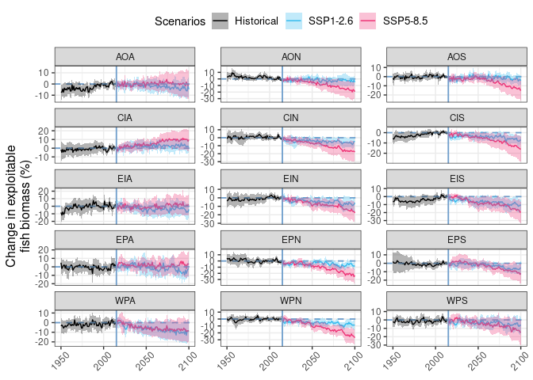

Plotting temporal changes to exploitable fish biomass in the Southern
Ocean
================
Denisse Fierro Arcos
2/19/24

- <a
  href="#changes-in-total-consumer-biomass-in-the-southern-ocean-over-time"
  id="toc-changes-in-total-consumer-biomass-in-the-southern-ocean-over-time">Changes
  in total consumer biomass in the Southern Ocean over time</a>
  - <a href="#loading-libraries" id="toc-loading-libraries">Loading
    libraries</a>
  - <a href="#setting-up-notebook" id="toc-setting-up-notebook">Setting up
    notebook</a>
  - <a href="#loading-data" id="toc-loading-data">Loading data</a>
  - <a
    href="#calculating-percentage-change-in-fish-biomass-estimates-from-global-fishmip-models"
    id="toc-calculating-percentage-change-in-fish-biomass-estimates-from-global-fishmip-models">Calculating
    percentage change in fish biomass estimates from global FishMIP
    models</a>
  - <a href="#calculating-mean-for-reference-period"
    id="toc-calculating-mean-for-reference-period">Calculating mean for
    reference period</a>
    - <a href="#measo" id="toc-measo">MEASO</a>
    - <a href="#ccamlr" id="toc-ccamlr">CCAMLR</a>
  - <a href="#defining-basic-plot-design"
    id="toc-defining-basic-plot-design">Defining basic plot design</a>
  - <a href="#plotting-temporal-change"
    id="toc-plotting-temporal-change">Plotting temporal change</a>
    - <a href="#measo-1" id="toc-measo-1">MEASO</a>
    - <a href="#ccamlr-1" id="toc-ccamlr-1">CCAMLR</a>

# Changes in total consumer biomass in the Southern Ocean over time

In this notebook, we will use all FishMIP global models to calculate the
mean ensemble percentage change in total exploitable fish biomass in the
Southern Ocean for the decade ending in 2050. The reference period for
this calculation is 2005-2014. We define “exploitable fish biomass” as
biomass for all marine organisms with weights between 10g and 100Kg.

## Loading libraries

``` r
#Data wrangling
library(tidyverse)
library(data.table)
#Combining plots
library(cowplot)
```

## Setting up notebook

We will define the folders where inputs are kept, and where outputs
should be saved.

``` r
#Base folder for project
base_folder <- "/rd/gem/private/users/camillan"

#Defining location of notebook outputs
out_folder <- "../outputs"
if(!dir.exists(out_folder)){
  dir.create(out_folder)
}
```

## Loading data

We will load the total consumer biomass data to calculate percentage
change, and masks to extract data for the MEASO and CCAMLR regions only.

``` r
#MEASO
measo_mask <- read_csv("../outputs/measo_regions_1deg.csv")
```

    Rows: 15679 Columns: 4
    ── Column specification ────────────────────────────────────────────────────────
    Delimiter: ","
    dbl (4): x, y, id, area_m

    ℹ Use `spec()` to retrieve the full column specification for this data.
    ℹ Specify the column types or set `show_col_types = FALSE` to quiet this message.

``` r
measo_keys <- read_csv("../outputs/measo_regions_keys.csv")
```

    Rows: 18 Columns: 2
    ── Column specification ────────────────────────────────────────────────────────
    Delimiter: ","
    chr (1): name
    dbl (1): id

    ℹ Use `spec()` to retrieve the full column specification for this data.
    ℹ Specify the column types or set `show_col_types = FALSE` to quiet this message.

``` r
#CCAMLR
ccamlr_mask <- read_csv("../outputs/ccamlr_stats_area_1deg.csv")
```

    Rows: 7444 Columns: 4
    ── Column specification ────────────────────────────────────────────────────────
    Delimiter: ","
    chr (1): GAR_Short_
    dbl (3): x, y, area_m

    ℹ Use `spec()` to retrieve the full column specification for this data.
    ℹ Specify the column types or set `show_col_types = FALSE` to quiet this message.

``` r
ccamlr_keys <- read_csv("../outputs/ccamlr_stats_area_keys.csv")
```

    Rows: 19 Columns: 2
    ── Column specification ────────────────────────────────────────────────────────
    Delimiter: ","
    chr (2): GAR_Name, GAR_Short_

    ℹ Use `spec()` to retrieve the full column specification for this data.
    ℹ Specify the column types or set `show_col_types = FALSE` to quiet this message.

``` r
#Getting a list of files containing biomass data
global_files <- list.files(base_folder, pattern = "global_10g-100kg.rds", 
                           full.names = T, recursive = T)

#Getting a list of models
members <- str_extract(global_files, "annual_(.*)_(h|s)", group = 1) |> 
  unique()
```

## Calculating percentage change in fish biomass estimates from global FishMIP models

We will go through each FishMIP model and calculate the mean fish
biomass for the decade between 2005 and 2014 (last decade of
`historical` period), and for the period between 2041 and 2050 (for the
two emission scenarios), and between 2091 and 2100 (two scenarios).
Finally, we will calculate the percentage change between these two
decades.

``` r
#Looping through each FishMIP model
for(m in members){
  #Load all data available for a single FishMIP model
  df_model <- str_subset(global_files, m) |> 
    map(~readRDS(.)) |> 
    map_df(~bind_rows(.)) 
  
  #Apply MEASO mask
  df_measo <- df_model |> 
    #Apply mask
    left_join(measo_mask, by = join_by(x, y)) |> 
    #Calculate mean per ensemble member
    group_by(year, mem, esm, scenario, id) |> 
    summarise(mean_bio = weighted.mean(biomass, area_m, na.rm = T))
  
  #Apply CCAMLR mask
  df_ccamlr <- df_model |> 
    #Apply mask
    left_join(ccamlr_mask, by = join_by(x, y)) |> 
    #Calculate mean per ensemble member
    group_by(year, mem, esm, scenario, GAR_Short_) |> 
    summarise(mean_bio = weighted.mean(biomass, area_m, na.rm = T))
  
  #Create name to save file  
  f_out_measo <- file.path(out_folder, 
                       str_c(m, "_yearly_perc_bio_change_data_measo.csv"))
  
  f_out_ccamlr <- file.path(out_folder, 
                       str_c(m, "_yearly_perc_bio_change_data_ccamlr.csv"))
  
  #Saving results for each model
  df_measo |> 
    fwrite(f_out_measo)
  
  df_ccamlr |> 
    fwrite(f_out_ccamlr)
}
```

## Calculating mean for reference period

Plots created here will show percentage change in biomass over time
under two emissions scenarios: `SSP1-2.6` and `SSP5-8.5`. Our reference
period is 2005-2014.

### MEASO

``` r
#Listing all relevant files to calculate biomass projections
bio_data_measo <- list.files(out_folder, 
                       pattern = "_yearly_perc_bio_change_data_measo.csv",
                       full.names = T) |> 
  map_df(~fread(.)) |> 
  #Remove rows outside regions of interest
  drop_na(id)

#Calculating reference period
ref_bio_measo <- bio_data_measo |> 
  filter(year >= 2005 & year <= 2014) |> 
  #Calculate mean per ensemble member
  group_by(mem, esm, id) |> 
  summarise(ref_bio_measo = mean(mean_bio, na.rm = T))
```

    `summarise()` has grouped output by 'mem', 'esm'. You can override using the
    `.groups` argument.

``` r
bio_data_measo <- bio_data_measo |> 
  #Add reference period to yearly biomass data
  left_join(ref_bio_measo, by = c("mem", "esm", "id")) |> 
  #Calculate percentage change per model/year(scenario)/region
  mutate(perc_change = ((mean_bio-ref_bio_measo)/ref_bio_measo)*100) |> 
  #Calculate mean and standard deviation for percentage change 
  #per year(scenario)/region
  group_by(year, scenario, id) |> 
  summarise(mean_change = mean(perc_change, na.rm = T),
            sd_change = sd(perc_change, na.rm = T)) |> 
  #Add names in FAO-EEZ keys
  left_join(measo_keys, by = "id") |> 
  ungroup()
```

    `summarise()` has grouped output by 'year', 'scenario'. You can override using
    the `.groups` argument.

    Warning in left_join(summarise(group_by(mutate(left_join(bio_data_measo, : Detected an unexpected many-to-many relationship between `x` and `y`.
    ℹ Row 13 of `x` matches multiple rows in `y`.
    ℹ Row 7 of `y` matches multiple rows in `x`.
    ℹ If a many-to-many relationship is expected, set `relationship =
      "many-to-many"` to silence this warning.

``` r
#Create name to save file  
f_out <- file.path(out_folder, "ensemble_perc_bio_change_data_measo.csv")

#Saving results for each model
bio_data_measo |> 
  write_csv(f_out)
```

### CCAMLR

``` r
#Listing all relevant files to calculate biomass projections
bio_data_ccamlr <- list.files(out_folder, 
                       pattern = "_yearly_perc_bio_change_data_ccamlr.csv",
                       full.names = T) |> 
  map_df(~fread(.)) |> 
  #Remove rows outside regions of interest
  drop_na(GAR_Short_)

#Calculating reference period
ref_bio_ccamlr <- bio_data_ccamlr |> 
  filter(year >= 2005 & year <= 2014) |> 
  #Calculate mean per ensemble member
  group_by(mem, esm, GAR_Short_) |> 
  summarise(ref_bio_ccamlr = mean(mean_bio, na.rm = T))
```

    `summarise()` has grouped output by 'mem', 'esm'. You can override using the
    `.groups` argument.

``` r
bio_data_ccamlr <- bio_data_ccamlr |> 
  #Add reference period to yearly biomass data
  left_join(ref_bio_ccamlr, by = c("mem", "esm", "GAR_Short_")) |> 
  #Calculate percentage change per model/year(scenario)/region
  mutate(perc_change = ((mean_bio-ref_bio_ccamlr)/ref_bio_ccamlr)*100) |> 
  #Calculate mean and standard deviation for percentage change 
  #per year(scenario)/region
  group_by(year, scenario, GAR_Short_) |> 
  summarise(mean_change = mean(perc_change, na.rm = T),
            sd_change = sd(perc_change, na.rm = T)) |> 
  #Add names in FAO-EEZ keys
  left_join(ccamlr_keys, by = "GAR_Short_") |> 
  ungroup()
```

    `summarise()` has grouped output by 'year', 'scenario'. You can override using
    the `.groups` argument.

``` r
#Create name to save file  
f_out <- file.path(out_folder, "ensemble_perc_bio_change_data_ccamlr.csv")

#Saving results for each model
bio_data_ccamlr |> 
  write_csv(f_out)
```

## Defining basic plot design

``` r
base_gg <- list(geom_line(linewidth = 0.5),
                #Adding no change line at 0 for reference 
                geom_hline(yintercept = 0, color = "#709fcc", linewidth = 0.65, 
                           linetype = 2),
                #Adding line dividing historical period and future projections
                geom_vline(xintercept = 2015, color = "#709fcc", 
                           linewidth = 0.65),
                #Adding SD as shading 
                geom_ribbon(aes(ymin = mean_change-sd_change,
                                ymax = mean_change+sd_change, fill = scenario),
                            alpha = 0.3, color = NA),
                #Manually setting colours to be used in plots
                scale_color_manual(values = c("historical" = "black",
                                              "ssp126" = "#33bbee", 
                                              "ssp585" = "#ee3377"), 
                                   name = "Scenarios",
                                   labels = c("Historical", "SSP1-2.6", 
                                              "SSP5-8.5")),
                scale_fill_manual(values = c("historical" = "black", 
                                             "ssp126" = "#33bbee", 
                                             "ssp585" = "#ee3377"), 
                                  name = "Scenarios",
                                  labels = c("Historical", "SSP1-2.6", 
                                             "SSP5-8.5")),
                guides(color = guide_legend(nrow = 1, title.position = "left")),
                theme_bw(),
                labs(y = "Change in exploitable\nfish biomass (%)"),
                theme(legend.position = "top", legend.justification = "center", 
                      legend.text = element_text(size = 10),
                      panel.grid.minor.y = element_blank(), 
                      axis.title.x = element_blank(),
                      axis.title.y = element_text(size = 12),
                      axis.text.x = element_text(angle = 45, vjust = 0.765, 
                                                 hjust = 0.65)))
```

## Plotting temporal change

### MEASO

``` r
bio_data_measo |> 
  ggplot(aes(x = year, y = mean_change, colour = scenario))+
  base_gg+
  facet_wrap(~name, scales = "free_y", ncol = 3)
```



``` r
#Saving plot
ggsave(filename = file.path(out_folder, "measo_perc_change.pdf"), 
       device = "pdf", width = 15, height = 12)
```

### CCAMLR

``` r
bio_data_ccamlr |> 
  drop_na() |> 
  ggplot(aes(x = year, y = mean_change, colour = scenario))+
  base_gg+
  facet_wrap(~GAR_Name, scales = "free_y", ncol = 3)
```


``` r
#Saving plot
ggsave(filename = file.path(out_folder, "ccamlr_perc_change.pdf"), 
       device = "pdf", width = 15, height = 15)
```
