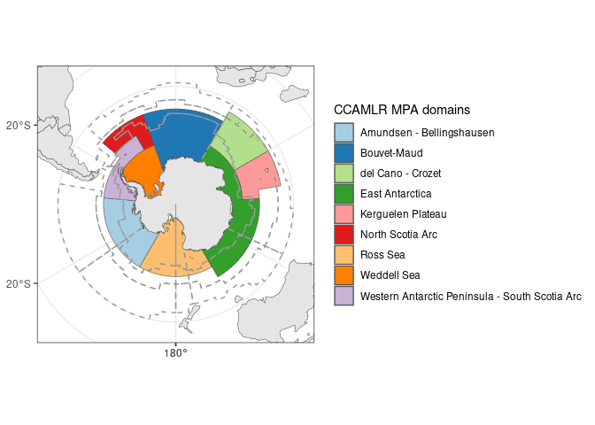

Map of CCAMLR MPA Planning Domains and MEASO regions
================
Denisse Fierro Arcos

- <a href="#ccamlr-mpa-planning-domains-and-measo"
  id="toc-ccamlr-mpa-planning-domains-and-measo">CCAMLR MPA Planning
  Domains and MEASO</a>
  - <a href="#loading-libraries" id="toc-loading-libraries">Loading
    libraries</a>
  - <a href="#loading-relevant-shapefiles"
    id="toc-loading-relevant-shapefiles">Loading relevant shapefiles</a>
  - <a href="#plotting-southern-ocean-models"
    id="toc-plotting-southern-ocean-models">Plotting Southern Ocean
    models</a>
    - <a href="#saving-plot" id="toc-saving-plot">Saving plot</a>

# CCAMLR MPA Planning Domains and MEASO

In this notebook, we will create a map with the limits of the nine
marine protected areas (MPA) planning domains from the Commission for
the Conservation of Antarctic and Marine Living Resources (CCAMLR).
These [nine
domains](https://www.ccamlr.org/en/science/mpa-planning-domains) are
used for planning and reporting on the development of MPAs. The limits
of the Marine Ecosystem Assessment for the Southern Ocean (MEASO) are
also included in the map.
[MEASO](https://sokiaq.atlassian.net/wiki/spaces/MEASO/overview) offers
standardised regions that researchers can use to assess and report
changes in Southern Ocean ecosystems.

## Loading libraries

``` r
library(sf)
```

    Linking to GEOS 3.10.2, GDAL 3.4.1, PROJ 8.2.1; sf_use_s2() is TRUE

``` r
library(dplyr)
```


    Attaching package: 'dplyr'

    The following objects are masked from 'package:stats':

        filter, lag

    The following objects are masked from 'package:base':

        intersect, setdiff, setequal, union

``` r
library(stringr)
library(rnaturalearth)
library(ggplot2)
library(measoshapes)
```

## Loading relevant shapefiles

``` r
#Location of CCAMLR shapefile
ccamlr_path <- "../../SO_shapefiles/CCAMLR_MPA_Planning_Domains/CCAMLR_MPA_Planning_Domains.shp"
#Loading shapefile
ccamlr <- read_sf(ccamlr_path) 

#Loading MEASO regions
measo <- measo_regions05 |> 
  #Remove temperate regions
  filter(str_detect(name, "T$", negate = T)) |> 
  #Matching CCAMLR CRS
  st_transform(st_crs(ccamlr))
```

    old-style crs object detected; please recreate object with a recent sf::st_crs()

``` r
#Getting Antarctica boundaries
world <- ne_countries(returnclass = "sf") |> 
  st_transform(crs = st_crs(ccamlr))
```

## Plotting Southern Ocean models

``` r
p1 <- ggplot()+
  #Plot CCAMLR
  geom_sf(data = ccamlr, aes(fill = Location))+
  #Choosing colourbling friendly palette
  scale_fill_brewer(type = "qual", palette = "Paired")+
  #Overlaying MEASO boundaries as lines
  geom_sf(data = measo, color = "#999999", fill = NA, linewidth = 0.5, 
          linetype = "dashed")+
  #Changing legend title
  guides(fill = guide_legend(title = "CCAMLR MPA domains"))+
  #Add world
  geom_sf(data = world)+
  #Setting map limits
  lims(x = c(-5774572.727594968, 5774572.727594968), 
       y = c(-5774572.727594968, 5774572.727594968))+
  #Applying B&W theme
  theme_bw()

p1
```



### Saving plot

``` r
# Saving plot as image file
ggsave("../outputs/ccamlr_measo_map.pdf", p1, device = "pdf", width = 9,
       height = 7)

#Saving plot as R object for further processing
saveRDS(p1, "../outputs/ccamlr_measo_map.rds")
```
