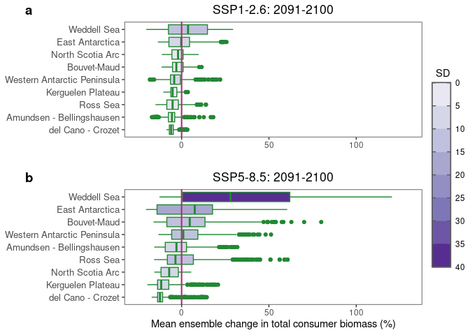

Visualing changes to exploitable fish biomass in the Southern Ocean
================
Denisse Fierro Arcos
2/19/24

- <a
  href="#changes-in-total-consumer-biomass-in-the-southern-ocean-over-time"
  id="toc-changes-in-total-consumer-biomass-in-the-southern-ocean-over-time">Changes
  in total consumer biomass in the Southern Ocean over time</a>
  - <a href="#loading-libraries" id="toc-loading-libraries">Loading
    libraries</a>
  - <a href="#setting-up-notebook" id="toc-setting-up-notebook">Setting up
    notebook</a>
  - <a href="#loading-ccamlr-mpa-planning-domains"
    id="toc-loading-ccamlr-mpa-planning-domains">Loading CCAMLR MPA Planning
    Domains</a>
  - <a href="#loading-percentage-change-in-tcb-data"
    id="toc-loading-percentage-change-in-tcb-data">Loading percentage change
    in TCB data</a>
  - <a href="#inter-model-variability-plot"
    id="toc-inter-model-variability-plot">Inter model variability plot</a>

# Changes in total consumer biomass in the Southern Ocean over time

In this notebook, we will use all FishMIP global models to calculate the
mean ensemble percentage change in total consumer biomass (TCB) in the
Southern Ocean for the decade ending in 2100. The reference period for
this calculation is 2005-2014.

## Loading libraries

``` r
#Data wrangling
library(tidyverse)
library(data.table)
#Combining plots
library(cowplot)
#Color palettes
library(RColorBrewer)
```

## Setting up notebook

We will define the folders where inputs are kept, and where outputs
should be saved.

``` r
#Base folder for project
base_folder <- "/rd/gem/public/fishmip/SOMEME/"

#Defining location of notebook outputs
out_folder <- "../outputs"
if(!dir.exists(out_folder)){
  dir.create(out_folder)
}
```

## Loading CCAMLR MPA Planning Domains

``` r
#CCAMLR mask
ccamlr_mask <- read_csv("../outputs/ccamlr_mpa_planning_1deg.csv") |> 
  #Rename coordinates columns
  rename("lon"="x", "lat"="y") |> 
  #Add names to mask from the CCAMLR keys file
  left_join(read_csv("../outputs/ccamlr_mpa_planning_keys.csv"),
            by = join_by("Name")) |> 
  #Change names to factor
  mutate(Location = case_when(str_detect(Location, "Peninsula") ~
                                str_remove(Location, " -.*"),
                              T ~ Location),
         #Shortening name for WAP
         Location = factor(Location)) |> 
  #Remove area column as it is not needed
  select(!area_m)
```

    Rows: 7443 Columns: 4
    ── Column specification ────────────────────────────────────────────────────────
    Delimiter: ","
    dbl (4): x, y, Name, area_m

    ℹ Use `spec()` to retrieve the full column specification for this data.
    ℹ Specify the column types or set `show_col_types = FALSE` to quiet this message.
    Rows: 10 Columns: 2
    ── Column specification ────────────────────────────────────────────────────────
    Delimiter: ","
    chr (1): Location
    dbl (1): Name

    ℹ Use `spec()` to retrieve the full column specification for this data.
    ℹ Specify the column types or set `show_col_types = FALSE` to quiet this message.

    Warning in left_join(rename(read_csv("../outputs/ccamlr_mpa_planning_1deg.csv"), : Detected an unexpected many-to-many relationship between `x` and `y`.
    ℹ Row 1919 of `x` matches multiple rows in `y`.
    ℹ Row 8 of `y` matches multiple rows in `x`.
    ℹ If a many-to-many relationship is expected, set `relationship =
      "many-to-many"` to silence this warning.

## Loading percentage change in TCB data

In [notebook
2](https://github.com/Fish-MIP/SOMEME/blob/main/scripts/02_Mapping_changes_SO.md),
we calculated the mean percentage change in TCB per FishMIP model. Here,
we will calculate an ensemble mean and inter model standard deviation.

``` r
#Listing all relevant files to calculate biomass projections
ensemble_data <- list.files(out_folder, 
                            pattern = "_perc_bio_change_data_map.csv", 
                            full.names = T) |> 
  #Loading all files
  map_df(~fread(.)) |> 
  #Calculations performed at grid cell level
  group_by(lat, lon) |> 
  #Apply calculations to biases only
  summarise(across(rel_change_mean00_ssp126:rel_change_mean00_ssp585, 
                   #Listing statistics to be calculated
                   list(mean = mean), 
                   #Setting column names
                   .names = "{.col}_{.fn}")) |> 
  #Join with CCAMLR MPA boundaries
  left_join(ccamlr_mask, by = join_by(lon, lat)) |>
  #Remove grid cells that are outside CCAMLR MPA area before grouping them
  drop_na(Location) |> 
  group_by(Location) |> 
  #Calculate standard deviation by area
  mutate(ssp126_sd = sd(rel_change_mean00_ssp126_mean, na.rm = T),
         ssp585_sd = sd(rel_change_mean00_ssp585_mean, na.rm = T))|> 
  ungroup()
```

    `summarise()` has grouped output by 'lat'. You can override using the `.groups`
    argument.

## Inter model variability plot

We will describe the base plot format and then apply it to both
emissions scenarios: SSP1-2.6 and SSP5-8.5

``` r
base_gg <- list(scale_fill_stepsn(colors = brewer.pal(7, "Purples"),
                                  n.breaks = 9, limits = c(0, 40),
                                  show.limits = T),
                geom_vline(xintercept = 0, color = "#aa3377", linewidth = 0.75),
                theme_bw(),
                lims(x = c(-25, 130)),
                guides(fill = guide_colorbar(title = "SD", reverse = T,
                                             title.hjust = 0.2,
                                             barheight = unit(7, "cm"),
                                             barwidth = unit(0.7, "cm"),
                                             ticks.colour = "#5b5b5b", 
                                             ticks.linewidth = 0.5, 
                                             frame.linewidth = 0.6,
                                             frame.colour = "#5b5b5b")),
                theme(axis.title.y = element_blank(), 
                      panel.grid = element_blank(), 
                      axis.text.y = element_text(size = 10), 
                      legend.position = "none", 
                      plot.title = element_text(hjust = 0.5)))
```

Applying plot template to each scenario before creating a composite
figure.

``` r
#SSP1-2.6
ssp126 <- ensemble_data |> 
  #Removing columns for SSP5-8.5
  select(!contains("ssp585")) |> 
  #Remove any grid cells with no values
  drop_na(rel_change_mean00_ssp126_mean) |> 
  #Group by location and calculate median
  group_by(Location) |> 
  mutate(med = median(rel_change_mean00_ssp126_mean, na.rm = T)) |>
  ggplot(aes(x = rel_change_mean00_ssp126_mean, 
             y = reorder(Location, med)))+
  geom_boxplot(aes(fill = ssp126_sd), color = "#228833")+
  base_gg+
  labs(title = "SSP1-2.6: 2091-2100", x = "")

#SSP5-8.5 
ssp585 <- ensemble_data |> 
  #Removing columns for SSP1-2.6
  select(!contains("ssp126")) |> 
  #Remove any grid cells with no values
  drop_na(rel_change_mean00_ssp585_mean) |> 
  #Group by location and calculate median
  group_by(Location) |> 
  mutate(med = median(rel_change_mean00_ssp585_mean, na.rm = T)) |>
  ggplot(aes(x = rel_change_mean00_ssp585_mean, 
             y = reorder(Location, med)))+
  geom_boxplot(aes(fill = ssp585_sd), color = "#228833")+
  base_gg+
  labs(title = "SSP5-8.5: 2091-2100")+
  theme(legend.position = "right")

#Getting shared legend
legend <- get_legend(ssp585)

#Removing legend from plot
ssp585 <- ssp585+
  theme(legend.position = "none")+
  labs(x = "Mean ensemble change in total consumer biomass (%)")

#Plotting everything together
all_plots <- plot_grid(plot_grid(ssp126, ssp585, ncol = 1, nrow = 2, 
                                 labels = c("a", "b"), label_x = 0.05),
                       legend, ncol = 2, rel_widths = c(1, 0.1))

#Check final map
all_plots
```



Saving plot as pdf.

``` r
ggsave(file.path(out_folder, "so_boxplots_00s_ccamlr.pdf"), 
       device = "pdf", width = 9, height = 7)

#Saving plot as R object for further processing
saveRDS(all_plots, file.path(out_folder, "so_boxplots_00s_ccamlr.rds"))
```

We can also save individual plots, but we will change their layout a
little before saving them as images and `R` objects.

``` r
#Removing title and adding legend
ssp126 <- ssp126+
  theme(legend.position = "right", plot.title = element_blank())
#Saving plot as image
ggsave(file.path(out_folder, "so_boxplots_00-126_ccamlr.pdf"), ssp126,
       device = "pdf")
#Saving plot as r object for further processing
saveRDS(ssp126, file.path(out_folder, "so_boxplots_00-126_ccamlr.rds"))

#Applying recipe
ssp585 <- ssp585+
  theme(legend.position = "right", plot.title = element_blank())
#Saving plot as image
ggsave(file.path(out_folder, "so_boxplots_00-585_ccamlr.pdf"), ssp585,
       device = "pdf")
#Saving plot as r object for further processing
saveRDS(ssp585, file.path(out_folder, "so_boxplots_00-585_ccamlr.rds"))
```
