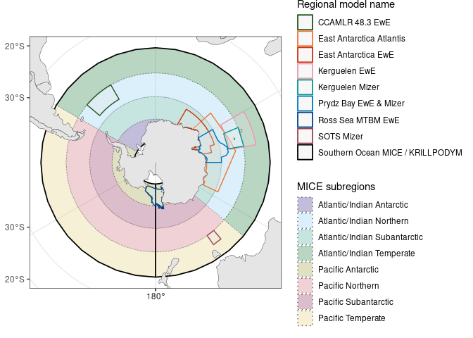

FishMIP models for the Southern Ocean
================
Denisse Fierro Arcos

- <a href="#fishmip-regional-models-for-the-southern-ocean"
  id="toc-fishmip-regional-models-for-the-southern-ocean">FishMIP regional
  models for the Southern Ocean</a>
  - <a href="#loading-libraries" id="toc-loading-libraries">Loading
    libraries</a>
  - <a href="#loading-fishmip-regional-models"
    id="toc-loading-fishmip-regional-models">Loading FishMIP regional
    models</a>
  - <a href="#plotting-southern-ocean-models"
    id="toc-plotting-southern-ocean-models">Plotting Southern Ocean
    models</a>
    - <a href="#saving-plot" id="toc-saving-plot">Saving plot</a>

# FishMIP regional models for the Southern Ocean

[FishMIP has over 30 regional marine ecosystem
models](https://fishmip.org/modellingteams.html), with six models
located within the Southern Ocean. Here we will create a map of the
Southern Ocean regional models.

## Loading libraries

``` r
library(sf)
```

    Linking to GEOS 3.10.2, GDAL 3.4.1, PROJ 8.2.1; sf_use_s2() is TRUE

``` r
library(dplyr)
```


    Attaching package: 'dplyr'

    The following objects are masked from 'package:stats':

        filter, lag

    The following objects are masked from 'package:base':

        intersect, setdiff, setequal, union

``` r
library(stringr)
library(rnaturalearth)
library(ggplot2)
```

## Loading FishMIP regional models

A shapefile with all FishMIP regional models can be downloaded from our
[THREDDS
server](http://portal.sf.utas.edu.au/thredds/catalog/gem/fishmip/FishMIP_regions/catalog.html).

We will also add the limits of the [KRILLPODYM
model](https://doi.org/10.3389/fmars.2023.1218003), which extends from
the Antarctic coast to $40^{\circ}$S. This is the same spatial domain as
the Southern Ocean MICE model, so we will use a single layer to
represent the total spatial extent of MICE and KRILLPODYM.

``` r
#Location of regional shapefile
reg_path <- "../../FishMIP_regions/Outputs/FishMIP_regional_models/FishMIP_regional_models.shp"

#Loading shapefile
fishmip_reg <- read_sf(reg_path) |> 
  #Keeping Southern Ocean regional models
  filter(str_detect(region, "Southern Ocean|Prydz|Antarctica|Kerguelen|Ross")) |> 
  #Add colours for each region
  mutate(col = c("#225522", "#ee7733", "#cc3311", "#ee99aa",
                 "#0077bb", "#004488", "#994455", "#000000")) |> 
  #South Polar Stereographic projection
  st_transform(crs = 3976)

#Loading Southern Ocean MICE boundaries containing sub regions
mice_path <- "../../FishMIP_regions/Shapefiles_Regions/Southern-Ocean_MICE/SupportInfo/SouthernOcean_MICE.shp"

#Loading shapefile
so_mice <- read_sf(mice_path) |> 
  mutate(subregion = str_c(region, band, sep = " "),
         #Adding colours for each region
         fill = c("#332288", "#88CCEE", "#44aa99", "#117733",
                 "#999933", "#cc6677", "#882255", "#ddcc77",
                 "#999933", "#cc6677", "#882255", "#ddcc77")) |> 
  #South Polar Stereographic projection
  st_transform(crs = 3976)

#Getting Antartica boundaries
world <- ne_countries(returnclass = "sf") |> 
  st_transform(crs = 3976)
```

## Plotting Southern Ocean models

``` r
ggplot()+
  #Add MICE subregions - Colouring by subregion
  geom_sf(data = so_mice, aes(fill = subregion), alpha = 0.3,
          linetype = "dotted")+
  scale_fill_manual(values = so_mice$fill)+
  geom_sf(data = fishmip_reg[fishmip_reg$region == "Southern Ocean",],
          aes(color = region), fill = NA, linewidth = 0.6)+
  geom_sf(data = fishmip_reg[fishmip_reg$region != "Southern Ocean",],
          aes(color = region), linewidth = 0.5, alpha = 0.3)+
  guides(color = guide_legend(title = "Regional model name", order = 1))+
  scale_color_manual(values = fishmip_reg$col,
                     labels = c("East Antarctica Atlantis",
                                "East Antarctica EwE",
                                "Kerguelen EwE",
                                "Kerguelen Mizer",
                                "Kerguelen Plateau EwE",
                                "Prydz Bay",
                                "Ross Sea MTBM",
                                "Southern Ocean MICE / KRILLPODYM"))+
  guides(fill = guide_legend(title = "MICE subregions"))+
  geom_sf(data = world)+
  lims(x = c(-5774572.727594968, 5774572.727594968), 
       y = c(-5774572.727594968, 5774572.727594968))+
  theme_bw()
```



### Saving plot

``` r
ggsave("../outputs/fishmip_reg_models_so.pdf", device = "pdf", width = 8,
       height = 7)
```
