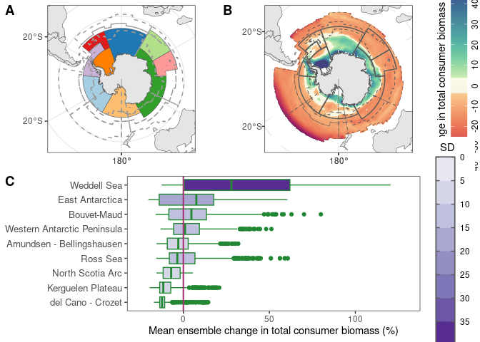

Creating a composite figure
================
Denisse Fierro Arcos

- <a
  href="#composite-figure-for-fishmip-regional-models-for-the-southern-ocean"
  id="toc-composite-figure-for-fishmip-regional-models-for-the-southern-ocean">Composite
  figure for FishMIP regional models for the Southern Ocean</a>
  - <a href="#loading-libraries" id="toc-loading-libraries">Loading
    libraries</a>
  - <a href="#loading-figures" id="toc-loading-figures">Loading figures</a>

# Composite figure for FishMIP regional models for the Southern Ocean

We will use Figures 1 to 3 to create a multipanel figure.

## Loading libraries

``` r
library(ggplot2)
library(cowplot)
```

## Loading figures

These figures were saved as `R` objects, so they can be loaded and
reused easily.

``` r
#Location of figures
base_path <- "../outputs/"

fig1 <- readRDS(file.path(base_path, "ccamlr_measo_map.rds"))
fig2 <- readRDS(file.path(base_path, "so_perc_change_map_00-585_ccamlr.rds"))
fig2_leg <- readRDS(file.path(base_path, 
                              "so_perc_change_map_00s_ccamlr_leg.rds"))
fig3 <- readRDS(file.path(base_path, "so_boxplots_00-585_ccamlr.rds"))

fig1_noleg <- fig1+theme(legend.position = "none")

comp_fig <- plot_grid(plot_grid(fig1_noleg, fig2, fig2_leg, nrow = 1, 
                         rel_widths = c(1, 1, 0.2), labels = c("A", "B", "")),
                      fig3, nrow = 2, labels = c("", "C"))

#Saving composite figure
ggsave(file.path(base_path, "fig_3panels_reg_map_change.pdf"), device = "pdf", 
       height = 9, width = 10)
```

Checking final plot. Note that this make look different from the saved
plot due to the resolution of your screen.

``` r
comp_fig
```


